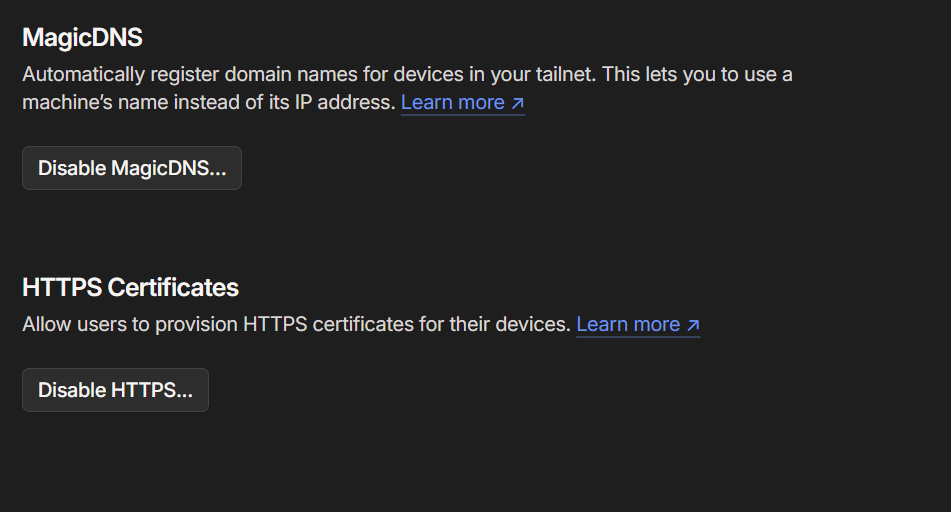
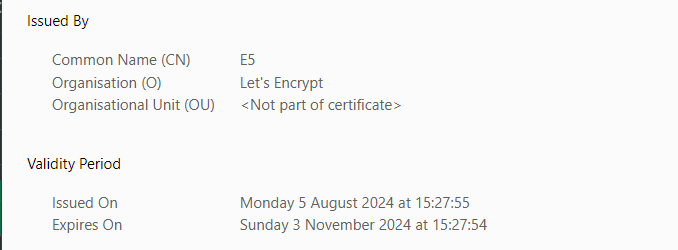

If any nodes behind `tailscale` VPN serving any application and don't want the hassle of setting up reverse proxy with domain and managing the certificates with your own domain, tailscale Provisions `Let's Encrypt` certificates and manages them. But we can uses them how ever we want and configure them how even we want.

## Enable settings

First we need to enable two settings on tailscale dashboard. Visit the dashboard and go to dns

- Enable `MagicDNS`
- Enable `HTTPS Certificates`



## Provision Certificates

To generate certificates, Machine name and tailscale's `tailnet` or `DNSName` of the machine.

```shell
tailscale cert  <MACHINE-NAME>.<TAILNET>.ts.net
```

You can either get `DNSName` from the dashboard or `tailscale CLI`, run

```shell
tailscale status --json
.
.
.
  "Self": {
      "ID": "n**********",
      "PublicKey": "nodekey:*************************",
      "HostName": "machine",
      "DNSName": "machine.tailnet.ts.net.",
      "OS": "linux",
      "UserID": ************,
      "TailscaleIPs": [
        "***.***.***.***",
        "************"
      ],
  }
```

To Provision the certificates, run 

```shell
tailscale cert machine.tailnet.ts.net
```

Result would be 

```shell
Wrote public cert to machine.tailnet.ts.net.crt
Wrote private key to machine.tailnet.ts.net.key
```

Now we've valid certificates from `Let's Encrypt`

## nginx configuration

Create a new nginx config at `/etc/nginx/sites-available/machine.tailnet.ts.net`

```conf
server {
    listen 80;
    listen 443 ssl;
    ssl_certificate /home/user/certs/machine.tailnet.ts.net.crt;
    ssl_certificate_key /home/user/certs/machine.tailnet.ts.net.key;
    server_name machine.tailnet.ts.net;

    location / {
        proxy_pass http://127.0.0.1:8080;
        proxy_set_header Host $host;
        proxy_set_header X-Real-IP $remote_addr;
        proxy_set_header X-Forwarded-For $proxy_add_x_forwarded_for;
        proxy_set_header X-Forwarded-Proto $scheme;
    }
}
```
{: file='/etc/nginx/sites-available/machine.tailnet.ts.net'}

In the above config, we are creating a proxy to a service running at `http://127.0.0.1:8080` from `machine.tailnet.ts.net`

Enable this config by running the following

```shell
sudo ln -s /etc/nginx/sites-available/machine.tailnet.ts.net /etc/nginx/sites-enabled/
```

Now restart the nginx

```shell
sudo systemctl reload nginx
```

Now visit the site and check for tls status.



## Conclusion 

Any queries, feel free to comment below.
